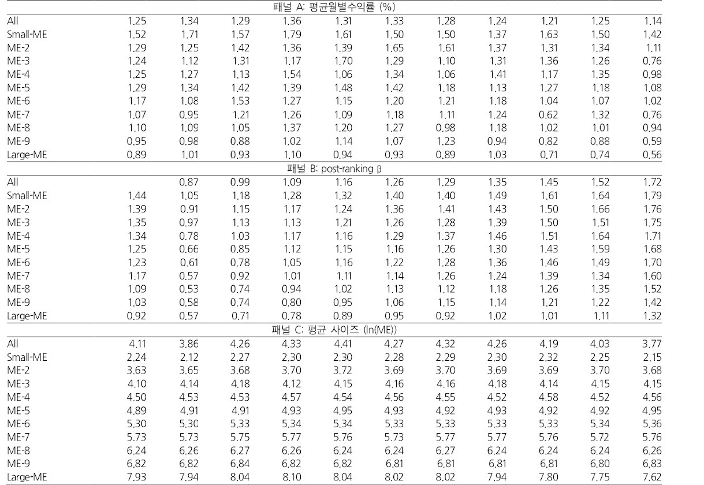
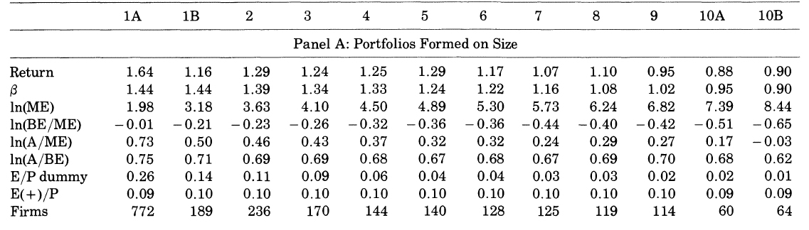
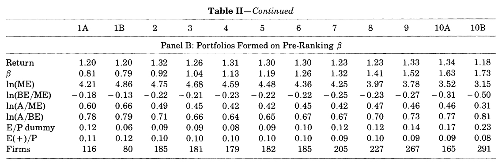
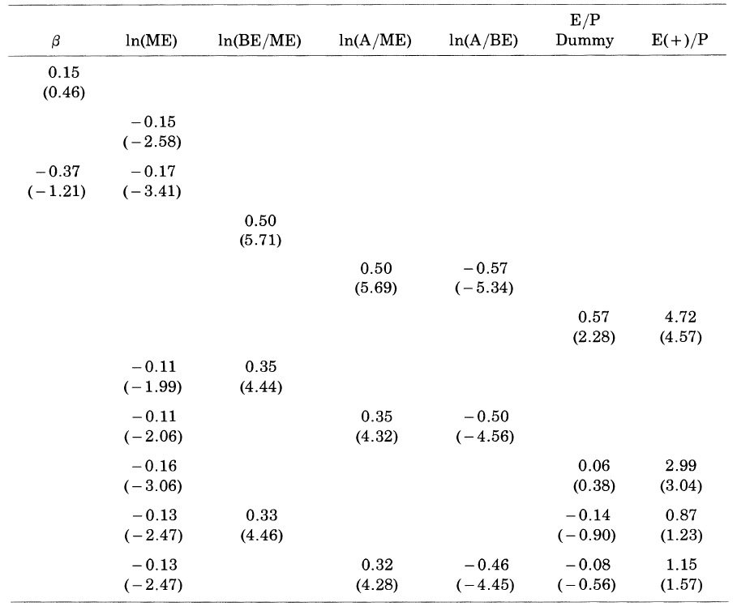
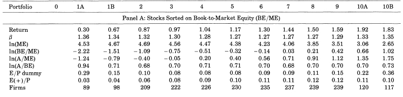
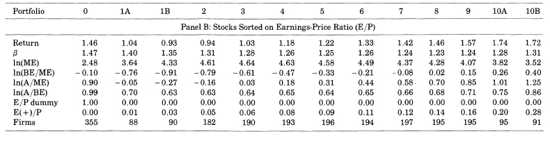
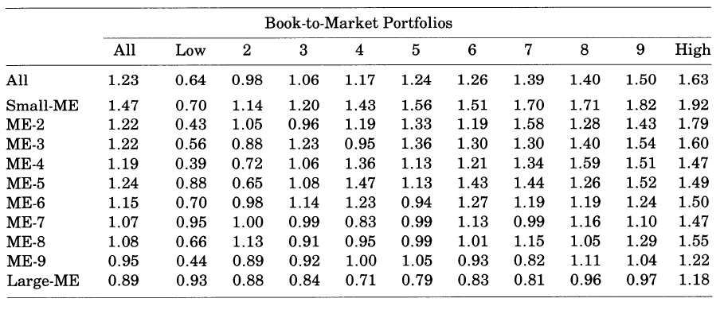

# The Cross-Section Expected Stock Returns
##### Brief presentation
> FAMA AND FRENCH (1992)
 
> every image slide is from document for education authorized by
 
Oren Hovemann,Yutong Jiang,Erhard Rathsack,Jon Tyler
 
CSV file is from http://mba.tuck.dartmouth.edu/pages/faculty/ken.french/Data_Library/f-f_factors.html
<!-- --- -->
--------------------------------------------------------------------

### Contents

1. Abstract & Introduction

2. Preliminaries

3.  β estimates

4. The relation between Average return and beta , Average return and size(ME)

5. The relation between Average return and E/P , Leverage , BE/ME

5. A Parsimonious Model for Average returns

6. Conclusion
--------------------------------------------------------------------
# 1. Abstract & Introduction

Two easily measured variables, `size and book-to-market equity`, combine to capture the cross-sectional variation in average stock returns `associated with market beta, size, leverage, book-to-market equity, and earnings-price ratios.` Moreover, when the tests allow for variation in `beta that is unrelated to size`, the relation between market and average return is `flat`, even when Beta is the `only explanatory variable.`

There are several empirical contradictions of the SLB Model

1. size effect of Banz(1981)
    - `ME` is the explanation of the cross-section of average returns provided by market beta.
2. positive relation between leverage and average return of Bhandari (1988)
    - `leverage` helps explain the  cross-section of average stock returns in tests that `include size as well as beta`
3. positive relation between BE/ME and average return of Stattman and Rosenberg, Reid and Lanstein (1985)
4. E/P help explain the cross-section of average returns of Basu (1983) and
E/P is a catch-all proxy for unnamed factors in R of Ball(1978)
5. relation between beta and average return disappears during the more recent 1963-1990 of Reinganum(1981) and Lakonishok and Shapiro(1986)

- ME , BE/ME , Leverage , E/P are scaled versions of price.
- it is reasonable to expect that some of them are `redundant` of Keim(1988)
--------------------------------------------------------------------
# 2. Preliminaries

> 논문의 1장은 예비 절차(Preliminaries)로 분석에 있어서 사용되는 데이터와 시장 베타의 측정 기준이 정리되어 있다.

 0. Fama-French 3 factor model 의 데이터 관측 시기는 `1963-1990년` 간이다.

 1. 데이터 분석은 `비금융회사`만을 포함하고 있다.(Data analysis includes only `non-financial companies`.)

     - why ? :
         - 비금융회사에서 높은 레버레지는 재정적으로 불안정하다는 것을 의미하지만, 금융회사의 경우 정상적인 경우일 수 있다.
         - A high leverage in a non-financial company means financially unstable, but it may be normal for a financial company.

2. `회계 변수`들은 그것이 설명하는 `수익률`보다 먼저 확인 가능하다.(`Accounting variables` can be checked before `profit rate` which it explains.)

    - So what did they do :
        - t-1 년 (1962-1989) 에 있는 모든 회계연도 말의 회계 자료를, t 년 7월부터 t+1 년 6월까지의 수익률과 대응시킨다.
        - 회계년도 말과 수익률 테스트 간에 최소 6개월의 차이를 둔다.
        - The six month gap between financial reporting and realized returns `insure the reflection` of all information into the stock pricing

        - `WHICH` data they used and `WHEN` did they take them :

        - BE/ME , LEVERAGE , E/P , A : `t-1년의 12월 말` 시가총액(ME)을 사용

        - ME : `t 년의 6월` 시가총액을 사용

        - pre-ranking beta : 24 to 60 monthly returns(as available) in the 5 years before July of year t. (Only using NYSE)

        - pre-ranking beta , post-ranking beta 를 계산할 때는, 전월 수익률과 당월 수익률을 합한 합산 베타를 적용한다.

~~~
        - return_p,t = beta_0 + `beta_1` * r_m,t_1 + `beta_2` * r_m,t + resid_p
        - beta_p = beta_1 + beta_2
~~~
--------------------------------------------------------------------

# 3. β estimates

- 각각의 베타들을 추정하기 위해서는, 회귀분석 작업이 필요하다. 즉, 모든 베타들에 대해서 회귀 분석 작업이 들어간다.
    - 베타 : `ME , E/P , A/ME , A/BE , β_m , BE/ME`
    - 주식별 베타 수치는 별도의 프로세스을 추가적으로 적용하여 만들어진다.
    - 포트폴리오 접근법 사용 why? :
      - 사이즈 효과를 베타로부터 제거하기 위해서 , to allow for variation in `beta that is unrelated to size.`

#### Calculating Post - ranking beta

1. NYSE 주식을 시가총액 순으로 10분위 기준점을 잡는다. `(10*1)`
    - NASDAQ이 표본에 추가되면, 포함된 시점부터 대부분의 포트폴리오에 small_cap 만 포함된다.
2. 사이즈 포트폴리오 내에서, NYSE 주식을 pre-ranking beta 순으로 정렬해(subdivide) 10분위 기준점을 잡는다. `(10*10)`
    - 사이즈-베타 포트폴리오는 7월~6월동안의 데이터로 만들어지고, 6월말에 리밸런싱된다.
3. 베타를 측정하는 방법 :
      - 동일 가중 월별 수익률을 만든 size-beta portfolio에 대해서 12달 계산한다.(7~12)
      - 1년마다 포트폴리오를 리밸런싱하고 같은 프로세스 아래에서 1963~1990 으로 총 330달에 대한 수익률을 계산한다.
      - NYSE , AMEX , NASDAQ 의 value-weighted 포트폴리오의 수익률을 시장 수익률의 대용치로써 사용해 베타를 측정한다.

##### 위의 표를 보고 베타에 대해 알 수 있는 2 가지 사실
- 각 사이즈 분위 안에서 post-ranking 베타는 pre-ranking 베타의 순서를 매우 유사하게 재현한다.
    - pre-ranking 베타가 실제 post-ranking 베타를 유사하게 재현한다. (재현력 , 예측력)

- 베타의 순서는 변형된 사이즈 순서가 아니다.
    -모든 사이즈 분위 내에서 ,ln(ME) 의 평균값은 베타로 정렬된 세부 포트폴리오들 간에 유사한 값을 지닌다.
--------------------------------------------------------------------
# 4. 평균수익률과 베타, 평균수익률과 사이즈의 관계
> - (Banz(1981))에 의하면, 사이즈와 R 은 Negative , 베타와 R은 Positive 한 상관성이 있다고 했다.
- model's central prediction : average return is positively related to beta, The betas of size portfolios are however, almost perfectly correlated with size.
- 위의 말은, SLB에서 진행한, 베타와 수익률간의 테스트가 사이즈 효과에 의해서 왜곡되었다고 주장하는 것.

표를 보게 되면, 평균수익률과 사이즈는 역상관성, 베타는 상관성을 띄는 것으로 보인다. 즉, 사이즈 포트폴리오는 SLB 모델을 지지한다.

- `사이즈 포트폴리오 내에서 사이즈와 베타 간의 상관 관계에 의한 왜곡된 결과이다.`
- beta 로 배열된 포트폴리오는 SLB 모델을 지지하지 않는다. 슈익률에 대한 스프레드가 거의 보이지 않는다.

- Panel B : Portfolios Formed on Pre-Ranking β
    - β 의 10분위 수가 1A(최소극단치)일때와 10B(최대극단치)일 때의 차이가 미비하다.
    - 1969년 이후로 시장 베타와 수익률의 관계가 사라졌다!! (Reinganum(1981), Lakonishok-Shapario(1986))

    - Table I 에서 사이즈 분위 내의 post-ranking 베타의 변화에 따른 평균 수익률의 변화를 보자!

### 사이즈와 연동된 베타는 평균수익률과 연관이 있다. 하지만, 무관한 베타는 상관관계가 없다.
- 사이즈 <-> 베타 (Negative) , 사이즈 <-> 평균수익률(Negative) , 베타 <-> 평균수익률(Positive)
--------------------------------------------------------------------
# 5. Fama-Macbeth Cross_sectional Regression
- time-series averages of the slopes from the month-by-month Fama-MacBeth regressions of the cross-section of stock returns on input variables.

#### Can beta Be Saved?
- other explanatory variables are correlated with true betas
  - beta has no power when used alone to explain average Return.
- the relation is obscured by noise in the beta estimates.
  - standard error is 0.05 or less. not seems to be imprecise.
  - post-ranking beta for the portfolios almost perfectly reproduce ordering of the pre-ranking betas. (post-ranking betas are informative about the ordering)
--------------------------------------------------------------------
~~~
- 평균 수익률(R)과 사이즈(ME) 간에는 강한 상관관계가 있다.
- 평균 수익률(R)과 베타(β) 간에는 상관성이 없다.
~~~
--------------------------------------------------------------------
# 6. 평균수익률과  E/P , Leverage , BE/ME의 관계
> 본 장에서는 BE/ME가 Return 과 강한 상관관계가 있음을 알아본다. (심지어 사이즈 효과보다 더 크다.)

average returns for July 1963 to December 1990 for portfolios formed on ranked values of BE/ME or E/P.(one-dimensional yearly sorts)

- 평균수익률(R)과 E/P 의 관계는 U자형이다.
- 평균수익률(R)과 BE/ME 의 관계는 정상관성을 띈다. 스프레드의 크기가 사이즈 포트폴리오의 2배에 달한다.
    - 음수 BE/ME는 제외하였다.(50개 기업에 불과하고 특정 기간에 집중되어 있다.)

- Interpretation of BE/ME :
    - BE/ME에서 장부가치는 잘 변하지 않는다. 이에 따라 고 BE/ME는 낮은 ME를 의미한다. 즉, 낮은 시장가치를 의미하는 것이다. 즉, 높은 BE/ME 는 기업의 부정적인 전망 신호를 의미한다.

- 베타(β)와 BE/ME 의 관계는 상관성은 보이지 않는다.
------------------------------------------------------------------
~~~
- BE / ME 가 사이즈와는 다른(distinctive) 중요한 설명변수이다.
- BE / ME 가 레버리지 변수의 역할을 대체하고 , E / P 의 역할을 대체한다.
~~~
--------------------------------------------------------------------

1. BE / ME :
    - BE / ME 와 ME 가 Cross_sectional Regression 시에 대체되지 않고, 두 베타 모두 유의미하다.

2. Leverage :
    - 장부 레버리지(A/BE) , 시장 레버리지 (A/ME) 두 가지 변수 사용.
    - 로그함수가 평균수익률에서 레버리지 효과 포착이 용이하다.즉, ln(A/BE) , ln(A/ME) 을 사용한다.

    - `장부 레버리지는 Negative , 시장 레버리지는 Positive`
    - `장부 레버리지와 시장 레버리지의 절대값은 유사하다.`

    - (시장 레버리지) - (장부 레버리지) 변수가 유의미해진다. `ln(A/ME) - ln(A/BE) = ln(BE/ME)` 가 된다. 즉, BE/ME 와 leverage는 강한 연관성이 존재한다.

    - StoryLine :
        - BE/ME 가 높을 경우는,
        1. low ME  -> Negative prospect
        2. high BE -> Implicitly leveraged(impose by Market)

 3. E / P :
     - 기대수익률(R) 에서 누락된 위험 요인들을 포괄하는 변수라고 규정한다.(Ball(1978))
     - `BUT`
     - 사이즈와 BE/ME를 더하면 , E / P 더미(dummies)의 영향력이 사라진다.
     - `E/P와 BE/ME의 정상관성 때문이다.`

--------------------------------------------------------------------
### 아래의 표는 사이즈와 BM/ME 를 기준으로 10X10 포트폴리오를 만들고, 평균수익률(R)을 표시한 것이다.

- 사이즈를 통제하면 BM/ME 가 평균 수익률의 강한 변동을 포착하게 되고,BM/ME 를 통제하면, 수익률에 사이즈 효과가 남는다.

~~~
1. 사이즈와 관련 없는 베타는 평균 수익률과의 연관성이 존재하지 않는다.

2. 평균 수익률에 있어 시장 레버리지(A/ME)와 장부 레버리지(A/BE) 간의 반대되는 역할은, BE/ME에 의해 포착된다.

3. E/P와 평균 수익률 간의 반상관성은(Negative) BM/ME 에 의해 흡수된다.
~~~

### 사이즈(ME)와 BE/ME 간의 상관성

- 반상관성을 띈다.(Negative correlation(-0.26))
- StoryLine :
    1. 사이즈가 작으면(low ME)
    2. 시가총액이 낮다.
    3. 회사의 전망이 부정적이다.
    4. high BE/ME
    5. High Risk
